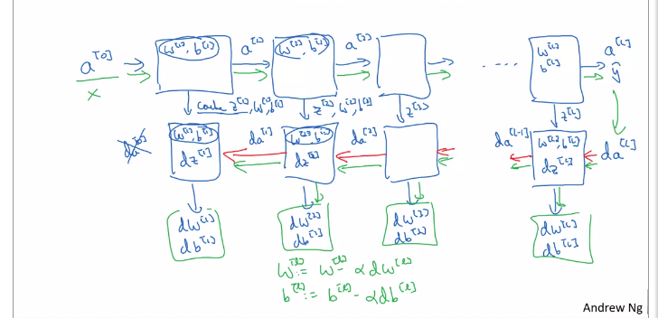

# Deep Neural Networks

[TOC]

### Deep L-layer Neural Network

#### What is the deep neural network?

up to this point we have dealt with single neuron neural network (logistic regression) and single hidden layer neural network, in this section we are going to learn more about the deep neural networks, we mean by deep a neural network wit more than one hidden layer, say 2, 3 ,4 .....n.


#### Deep neural network notation

assume we have a neural network with 3 input features,  3 hidden layers at which two of them have 5 units while only one is of 3 hidden units, in addition there is a single output layer as shown in figure 1


​																									figure (1): Simple deep neural network

so the notation we are going to use is:

```
L : the number of layers in the network
L = 4

r[l] : the number of units in the layer l
r[0] = 3 , r[1] = 5 , r[2] = 5 , r[3] = 3 , r[4] = 1

a[l] ; the activation of the layer l
a[l] = g[l](z[l])

W[l] : the wieghts of z[l]

b[l]: is the baias parameter in the layer l
```


### Forward Propagation in a Deep Network

#### Forward propagation with a single training example

given a single training example x, lets see how to perform the forward propagation through the neural network:

```
for the first layer
z[1] = W[1] * x + b[1]
a[1] = g[1](z[1])

for the secon layer
z[2] = W[2] * a[1] + b[2]
a[2] = g[2](z[2])

for the third layer
z[3] = W[3] * a[2] + b[3]
a[3] = g[3](z[3])

for the fourth layer
z[4] = W[4] * a[3] + b[4]
a[4] = g[4](z[4])

note: x can be replaced with a[0] at represents the activation of the input layer

as a general rule:
z[l] = W[l] * a[l-1] + b[l] 
a[l] = g[l](z[l])
```


#### Vectorized implementation

```
Z[1] = W[1] * A[0] + b[1]
A[1] = g[1](Z[1])

Z[2] = W[2] * A[1] + b[2]
A[2] = g[2](Z[2])

Z[3] = W[3] * A[2] + b[3]
A[3] = g[3](Z[3])

Z[4] = W[4] * A[3] + b[4]
A[4] = g[4](Z[4])

note:
Z[l] is a matrix of z[l][i] stacked as a column vector

as a general rule:
Z[l] = W[l] * A[l-1] + b[l]
A[l] = g[l](Z[l])

```


### Getting your Matrix Dimensions Right

#### Single Training example

as all the operations in neural networks are matrices-based, then getting the dimensions of the matrices operations right is an important issue in the neural network. let's learn how to keep them right, we are going to use the neural network depicted in figure (1) to illustrate this issue:

```
for the first layer we have:
3 input features = r[0]
5 hidden units = r[1]
and
z[1]      =       W[1]        *        a[0]    +     b[1]
(r[1],1)  =   (r[1],r[0])     ,      (r[0],1)  ,     (r[1],1)
(5,1)     =      (5,3)        ,       (3,1)    ,        (5,1)

for the second layer we have:
5 input features = r[1]
5 hidden units = r[2]
and
z[2]      =       W[2]        *        a[1]    +     b[2]
(r[2],1)  =   (r[2],r[1])     ,      (r[1],1)  ,     (r[2],1)
(5,1)     =      (5,5)        ,       (5,1)    ,        (5,1)

for the third layer we have:
5 input features = r[2]
3 hidden units = r[3]
and
z[3]      =       W[3]        *        a[2]    +       b[3]
(r[3],1)  =   (r[3],r[2])     ,      (r[2],1)  ,     (r[3],1)
(3,1)     =      (3,5)        ,       (5,1)    ,        (3,1)

for the fourth layer we have:
3 input features = r[3]
1 hidden units = r[4]
and
z[4]      =       W[4]        *        a[3]    +     b[4]
(r[4],1)  =   (r[4],r[3])     ,      (r[3],1)  ,     (r[4],1)
(1,1)     =      (1,3)        ,       (3,1)    ,        (1,1)

as a general rule:
W[l] dimension is: (r[l],r[l-1]) 
b[l] dimension is: (r[l],1)
z[l] dimension is: (r[l],1)
a[l] dimension is: (r[l],1)

for back probagation
dW[l] dimension is: (r[l],r][l-1]) 
db[l] dimension is: (r[l],1)
dZ[l] dimension is: (r[l],1)
da[l] dimension is: (r[l],1)
```


#### Vectorized implementation

```
for the first layer we have:
50 training example = m
3 input features = r[0]
5 hidden units = r[1]
and
Z[1]      =       W[1]        *        A[0]    +     b[1]
(r[1],m)  =   (r[1],r[0])     ,      (r[0],m)  ,     (r[1],m)
(5,50)     =      (5,3)        ,       (3,50)    ,        (5,1)

for the second layer we have:
5 input features = r[1]
5 hidden units = r[2]
and
Z[2]      =       W[2]        *        A[1]    +     b[2]
(r[2],m)  =   (r[2],r[1])     ,      (r[1],m)  ,     (r[2],m)
(5,50)     =      (5,5)        ,       (5,50)    ,        (5,1)

for the third layer we have:
5 input features = r[2]
3 hidden units = r[3]
and
Z[3]      =       W[3]        *        A[2]    +       b[3]
(r[3],m)  =   (r[3],r[2])     ,      (r[2],m)  ,     (r[3],m)
(3,50)     =      (3,5)        ,       (5,50)    ,        (3,1)

for the fourth layer we have:
3 input features = r[3]
1 hidden units = r[4]
and
Z[4]      =       W[4]        *        A[3]    +     b[4]
(r[4],m)  =   (r[4],r[3])     ,      (r[3],m)  ,     (r[4],m)
(1,50)     =      (1,3)        ,       (3,50)    ,        (1,1)

as a general rule:
W[l] dimension is: (r[l],r[l-1]) 
b[l] dimension is: (r[l],m)
Z[l] dimension is: (r[l],m)
A[l] dimension is  (n[l],m)

for back probagation
dW[l] dimension is: (r[l],r][l-1]) 
db[l] dimension is: (r[l],m)
dZ[l] dimension is: (r[l],m)
dA[l] dimension is  (n[l],m)
```


### Why Deep Representation??!

#### intuition about deep representation

Assume you are building a system for face recognition which takes a picture as an input and predict whether this picture is a face or not a face as shown in figure (2)


​								                           			figure (2): deep face recognition model

you can think of the first layer as being simple features detector such as horizontal, vertical and inclined  edges in the input picture where each neuron in the first layer will learn a certain feature, the in the second layer the network goes into much deeper details such as face parts (eye, nose, mouth ... etc) by each neuron in the second, finally the network goes through  detecting a complete face while the last layer gives the prediction of the input picture.

the main point here is as you go deeper through the network, , much more complex details are being learned  to produce the final output. further,  the same hierarchical representation  is possible for different types of data  such as audio, text ....etc


### Building Blocks of Deep Neural Networks 

#### Forward and backward functions

assume you have a deep neural network as this one shown in figure (1), lets take a certain layer and look at the computations of that layer:

```
for the layer l, we have:
W[l], b[l]
forward probagation:
input: a[l-1]
output a[l]
according to :
z[l] = W[l] * a[l-1] + b[l]
a[l] = g[l](z[l])
chache: z[l], W[l], b[l], a[l-1] to be used in backward propagation

backward propagation:
input: da[l], z[l]
output da[l-1], dW[l], db[l]
```

these are the main computation of a single layer, and hence, by combining these computations for each layer we end up having a deep neural network as shown in figure (3):



​																				figure(3): Deep neural network building blocks


### Forward and Backward Propagation

#### Forward propagation for layer l

as we saw in previous lesson, for a certain layer l we have :

```
input: a[l-1]
output: a[l]
cache: z[l], w[l], b[l], a[l-1]
for single training example :
z[l] = W[l] * a[l-1] + b[l]
a[l] = g[l](z[l])

the vectorized implementation:
Z[l] = W[l] * A[l-1] + b[l]
A[l] = g[l](Z[l])
```


#### Backward propagation for layer l

for a certain layer l we have:

```
input: da[l]
output: da[l-1], dW[l], db[l]
for single training example :
dz[l] = da[l] x g~[l](z[l])  = W[l+1]^T * dz[l+1] x g~[l](z[l])
dW[l] = dz[l] * a[l-1]^T
db[l] = dz[l]
da[l-1] = W[l]^T * dz[l]

the vectorized implementation:
dZ[l] = dA[l] x g~[l](Z[l])  = W[l+1]^T * dZ[l+1] x g~[l](Z[l])
dW[l] = (1/m) * dZ[l] * A[l-1]^T
db[l] =  (1/m) np.sum(dZ[l] * A[l-1]^T, axis = 1, keepdims =True)
dA[l-1] = W[l]^T * dZ[l]
```


### Parameter vs Hyper-parameter 

#### What are hyper-parameters?

in neural network, there two factor affecting the output of the neural network including:

Parameters: are those internal or local variables that are directly related to the learning process including

- Weights (W) 
- Bias (b)

Hyper-parameters: are those global variables that control the parameter of the neural network such as 

- learning rate  

- number of iterations,

- number of layers

- number of units

- choice of activation functions

bear in mind that building a deep learning model is an empirical process, and thus you need to try different combination of hyper-parameters till you end up happy with your results