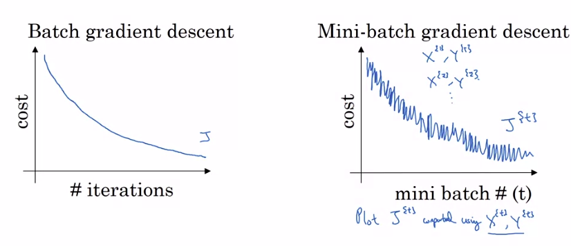
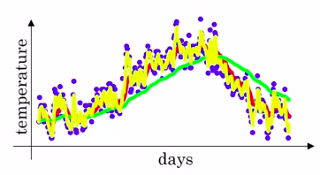
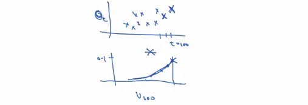
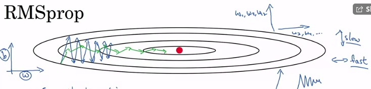
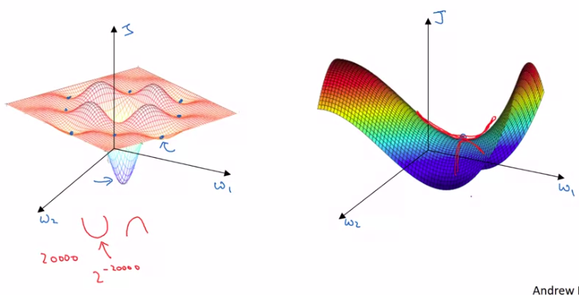
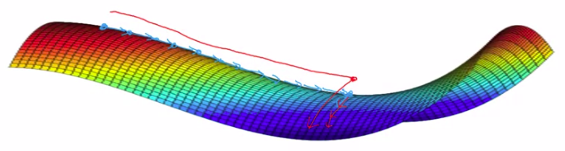

# Optimization algorithms

[TOC]

Hello, and welcome back. In this part, you learn about optimization algorithms that will enable you to train your neural network much faster. You've heard that applying machine learning is a highly empirical process, is a highly iterative process. In which you just had to train a lot of models to find one that works really well. So, it really helps to really train models quickly. One thing that makes it more difficult is that Deep Learning tends to work best in the regime of big data. We are able to train neural networks on a huge data set and training on a large data set is just slow. So, what you find is that having fast optimization algorithms, having good optimization algorithms can really speed up the efficiency of you and your team.  Let's get started.


### Mini-batch gradient descent

#### Batch vs mini-batch gradient descent

we learned previously that vectorization allow us to perform our computation on (m) training examples without the need to use explicit **for loop**. This is getting done by formulating our data in a matrix format as follow:

$X = [x^{(1)},x^{(2)},x^{(3)}..........x^{(m)}]$

$Y = [y^{(1)},y^{(2)},y^{(3)}..........y^{(m)}]$

where the dimension of X is $(n_x,m)$ and the dimension of Y is $(1,m)$ . it worth noting that even the vectorization could speed up the training process, however; it may not be very efficient technique in case of large datasets (millions of training examples). In the basic  gradient descent algorithm, you have to process the whole dataset **(batch gradient descent)** before taking one little step of gradient descent. So, it is possible to get a much faster algorithm if you let gradient descent start to make some progress even before finishing training on the whole dataset using smaller training sets called **(mini-batches)**.

Here is the solution, assume you split your training set into smaller sets that are called **mini-matches** as follow assuming that the **batch size** is 1000 training example and each batch is indicated a curly bracket of the patch number **t** and the whole number of batches **T** :

$X = [x^{(1)},x^{(2)},......x^{(1000)}|x^{(1001)},x^{(1002)},......x^{(2000)}|......x^{m}]$

​			    		$X^{\{1\}}$							    $X^{\{2\}}$  ................

$Y = [y^{(1)},y^{(2)},......y^{(1000)}|y^{(1001)},y^{(1002)},......y^{(2000)}|......y^{m}]$

​			    		$Y^{\{1\}}$							    $Y^{\{2\}}$   ...............

And thus, the mini-batch $t$ is comprised if the mini-batch: $X^{\{t\}}$, $Y^{\{t\}}$. Let see how mini-batch gradient descent works:

#### Mini-batch gradient descent

In a very simple manner , what we are going to do with **mini-batch gradient descent** is quite similar to our implementation in **batch gradient descent** but with a complete training cycle on each batch as shown in the following code:

```
for i in range(T):
	#forward prop
	z[1] = W[1]X{t} + b[1]
	A[1] = g[1](Z[1])
	.
	.
	.
	.
	A[L] = g[l](Z[l])
	
	#compute cost J
	J = (1/batch_size) = sum_i=1_L(yhat(i),y(i)) # for X{t},Y{t}
	# back prop with respect to j{t} using X{t},Y{t}ending up with
	W[l] = W[l] - alpha*dw[l]
	b[l] = b[l] - alpha*db[l]
	
```

It worth noting that each pass through a mini-batch is called **epoch**

### Understanding the mini-batch gradient descent

In the previous lesson, you saw how you can use mini-batch gradient descent to start making progress and start taking gradient descent steps, even when you're just partway through processing your training set even for the first time. In this lesson, you learn more details of how to implement gradient descent and gain a better understanding of what it's doing and why it works.

#### Training with mini batch gradient descent 

Assume the following comparison between the cost function value in batch gradient descent versus mini batch gradient descent as shown in figure (1).



​																			figure(1): Cost function in batch / mini batch gradient descent.

With batch gradient descent in each iteration, you will expect the cost to go downward smoothly  on every single iteration. On the other side, your cost function **may not** decrease on every single iteration and may as shown in the right side. This is because you are training on a different $X^{\{t\}}, Y^{\{t\}}$   each iteration and thus your cost function may keep fluctuating up and down but mainly with a downward trend.

#### Choosing your mini-batch size

One of the most important you need to chose to reduce the effect of mini-batch cost fluctuation is the **batch size** and thus:

1. If mini batch size = m >>> batch gradient descent >>>  $X^{\{t\}}, Y^{\{t\}}$ = $X, Y$ .
2. if mini batch gradient descent = 1 >>> Stochastic gradient descent >>> every example is a mini batch $X^{\{t\}}, Y^{\{t\}}$ = $X^{(i)}, Y^{(i)}$  and thus it would never **converge** .
3. in practice, batch size would be something in between (1 and m)

| stochastic gradient descent (1)                              | batch size in between (not big and not small )               | batch gradient descent (m)  |
| ------------------------------------------------------------ | ------------------------------------------------------------ | --------------------------- |
| loose speed-up from vectorization  because you are training using single examples | fastest learning and making progress without needing to wait the entire training set | too much time per iteration |

#### Guidelines for choosing mini-batch size

1. for small training sets : use batch gradient descent
2. for larger datasets : use batch of size as power of   **$2^r$** where **r** $\geq$ 6  
3. make sure that your batch size fits in the memory to avoid crashing


### Exponentially weighted average 

I want to show you a few optimization algorithms That are faster than gradient descent. In order to understand those algorithms,  you need to be able they use something called exponentially weighted averages. Also called exponentially weighted moving averages in statistics. Let's first talk about that, and then we'll use this to build up to more sophisticated optimization algorithms.

#### How it works??

we are going to explain the Exponentially weighted average using the temperature per year days as shown in figure (2). the temperature looks noisy **(purple points)** and if you want to compute the trends coming out of the local moving average of the temperature, here is what you can do



assume $v_0 = 0$

for the first day: $v_1 = 0.9 *v_0 + 0.1* temp_1$

for the second day: $v_2 = 0.9 *v_1 + 0.1* temp_2$

and so on, computing this quantities for the whole year will give you something like the curve fitted in **red** which is called **Exponentially weighted average**. let's have a look on the equation used to compute the moving average in its general form:

$$
v_t =  (1-\beta) * temp_t + \beta* v_{t-1}
$$
the $\beta$ value indicates the number of days to average on. For example, if beta is 0.9, then it means that you are averaging  over $\frac{1}{1-\beta}$ days

assume that $\beta = 0.98$ which means averaging over the last 50 days and if you plot that you get something like the **green line**. We could notice that having very high $\beta$  value we get much smother plot because you are averaging over larger number of days but also the curve is shifted to the right because you are averaging over larger period which makes the **Exponentially weighted average** adapts more slowly when the temperature changes . To sum up, when $\beta$ is large, then you give more weight to the previous value and less weight to what ever you are seeing right now.

if $\beta = 0.5$ which means averaging over the last 2 days and if you plot that you get something like the **yellow line**. this means that your equation is more susceptible to noise and outliers but it adapts much more quickly.

these are the basics of computing the exponentially weighted average, next lesson we are going to see how to employ it to speed up the learning process.


#### Understanding exponentially weighted averages

In the last lesson, we talked about exponentially weighted averages. This will turn out to be a key component of  several optimization algorithms that you used to train your neural networks. So, in this lesson, I want to delve a little bit deeper into intuitions for what this algorithm is really doing.

#### **Exponentially weighted averages in details**

recall that equation (1) is key to compute the weighted average and assume we have the following implementation of equation (1) to compute the temperature:

$ v_{100} = (1-\beta) * temp_{100} + \beta* v_{99} $

$ v_{99} =  (1-\beta) * temp_{99} + \beta* v_{98} $

$ v_{97} = (1-\beta) * temp_{98} + \beta* v_{97}  $

by substitution assuming $\beta = 0.9$ :

 $  v_{100} = 0.1 * temp_{100} + 0.9* (0.1*temp_{99} +0.9 (0.1*temp_{98} + 0.9 *v_{97} ) ) $ ...........................

$\ \ \ \ \ \ \ \ =0.1 * temp_{100} + 0.1*0.9 *temp_{99} + 0.1*(0.9)^2 * temp_{98} + 0.1* (0.9)^3 * temp_{97}$ ...........

So this is really a way to sum and that's a weighted average of **temp 100**, which is the current days temperature and we're looking for  a perspective of V100 which you calculate on the 100th day of the year. the result is an exponentially decaying function for **time** versus **temperature** as shown in figure (3) 



​																						Figure(3): Exponentially decaying function Vs temperature

And thus, the temperature calculation is obtained by multiplying element-wisely the temperature values by the exponential weights.

Finally, you may ask how many days the temperature is  averaging over, well it turns out that $$0.9^{10} = 0.35 = \frac{1}{e}$$ and generally  if you have $(1-\epsilon)$ and in this example $\epsilon = 0.1$ then $(1-\epsilon)^{\frac{1}{\epsilon}} = \frac{1}{e}$ . in other words, it takes about 10 days for the hight in exponentially weighted function to decay around 0.333 already $\frac{1}{e}$ of the peak. And hence, when $\beta =0.9$ we say that, this is as if you're computing an exponentially weighted average that focuses on just the last 10 days temperature. Because it's after 10 days that the weight decays to less than about a third of the weight of the current day.

#### Implementing  Exponentially weighted average

let's talk about how to implement this in python

```
#initializin V with zero
v = 0
V_temp = []
temps = [1,2,3,4m5,6........temp_n]
for temp in temps
	V= B*V - (1-B)* temp
	V_temp.append(V)
```


### Bias correction in exponentially weighted averages

#### Bias correction

Initializing $v_t$ to zero leads to computing biased estimates especially in the initial periods when computing the moving averages that lead to in accurate estimates, lets see how

$v_t =  (1-\beta) * temp_t + \beta* v_{t-1}$

$v_o = 0$  and $\beta = 0.98$

$v_1 =  (0.02) * temp_1 + .98*0 =0.02*temp_1$ 

more clearly if the first day temperature is 40 the the second day temperature is 8

$v_2 =  (0.02) * temp_1 + .98*0.02*temp_1$ 

$v_2 = 0.0196*temp_1 + 0.02*temp_2$

when computing $v_2$ it is getting much smaller, to over com this issue and get more accurate results in the initial period we do the following:

we replace $v_t$ with $\frac{v_t}{1-\beta^t}$ where **t** is the current day you are computing temperature on, lets take a concrete example:

when $t= 2$: $1-\beta^2 = 1-0.98^2 = 0.0396$

$\frac{v_2}{0.0396} = \frac{0.0196*temp_1 + 0.02*temp_2}{0.0396}$

as a result, we are averaging $temp_1 and\  temp_2$ to remove this bias. One more thing to note is when t is **very large** the $\beta^t$ is very small and you are ending up dividing by approximately 1


### Gradient descent with momentum

#### Momentum explained

There's an algorithm called momentum, or gradient descent with momentum that almost always works faster than the standard gradient descent algorithm. In one sentence, the basic idea is to compute an exponentially weighted average of your gradients, and then use that gradient to update your weights instead. In this lesson, let's unpack that one sentence description and see how you can actually implement this. 

Assume we have a cost function **J** that we want to optimize, gradient descent or mini-batch gradient descent may require lots of iteration to converge to the local minima due to the oscillation of the gradient computations, lets see the logic of **momentum** o :

On iteration **t**:

1. compute the derivatives **dw,db** on the current mini-batch or the whole training data (batch).
2. compute **Vdw** :
   $V_{dw}= \beta* v_{dw} +(1-\beta)dw $
3. compute **Vdb** :
   $V_{db}= \beta* v_{db} +(1-\beta)db $
4. update the weights: 
   $W= W - \alpha*v_{dw} $ 
    $b = b-\alpha* v_{db}$

what this computation does is smoothing the gradient descent computations, by reducing the **oscillation** of the gradients during the computation, and thus your algorithm become much faster in converging to the minima

lets see how to implement the momentum algorithm, according to the steps (1-4) we have 2 Hyperparameters $\alpha$ and $\beta$  which control your exponentially weighted average, the most common value for $\beta$ is 0.9 so that it averaging over the last 10 iterations of gradient descent. Practically, this value works very well and you can alter it and observe the difference.  With respect to the **bias correction**, in practice practitioner do not use this because after 10 iterations the moving average will warm up and there will be no bias. One more thing to note is that **Vdw** and **Vdb** are initialized with matrix and vector of zeros respectively with their shapes corresponds to each of **dw** and **db**

### RMSprop

#### RMSprob explained

You've seen how using momentum can speed up gradient descent. There's another algorithm called RMSprop, which stands for root mean square prop, that can also speed up gradient descent. Let's see how it works.



​																	figure(4): RMSprob explained

Assume we have a cost function **J** that we want to optimize, gradient descent or mini-batch gradient descent may require lots of iteration to converge to the local minima due to the oscillation of the gradient computations as shown in figure (4)  as indicated with the **blue arrows**. To provide intuition for this example lets assume that our optimization problem in two variables **(w and b)** where the vertical axis depicts the **b** values and the horizontal axis depicts the **w** values as shown in the most lift side if figure (4), and now we need to slow down the learning process in the **vertical** direction and speed it up in the **horizontal** direction. Lets see the logic of **RMSprop**: 

On iteration **t**:

1. compute the derivatives **dw,db** on the current mini-batch or the whole training data (batch).

2. compute **Sdw** :
   $S_{dw}= \beta* s_{dw} +(1-\beta)dw^2 $ 

3. compute **Sdb** :

   $S_{db}= \beta* s_{db} +(1-\beta)db^2 $

4. RMSprop update the weights as follow: 
   $W= W - \alpha\frac{dw}{\sqrt{s_{dw}}} $  
   $b = b-\alpha* \frac{db}{\sqrt{s_{db}}}$

note that squaring both **dw** and **db** is an element-wise operation. in practice this means keeping an exponentially weighted average of the squares of the derivative. To gain intuition about how RMSprob works ,  recall from our example that we want to slow down the learning process in the **vertical** direction and speed it up in the **horizontal**. Thus, with these terms $s_{dw}$ and $s_{db}$ we are hoping that  $s_{dw}$ will be relatively small so that we are dividing by relatively small number. Whereas $s_{db}$ will be relatively large so that we are dividing by relatively large number in order to slow down the updates in the vertical dimension. And indeed if you look at the derivatives, these derivatives are much larger in the vertical direction than in the horizontal direction. So the slope is very large in the b direction, Because the function is sloped much more steeply in the vertical direction than as in the b direction, than in the w direction, than in horizontal direction. And so, db squared will be relatively large. So $s_{db}$ will be relatively large, whereas compared to that dW will be smaller, or dW squared will be smaller, and so $s_{dW}$ will be smaller. So the net effect of this is that your updates in the vertical direction are divided by a much larger number, and so that helps damp out the oscillations. Whereas the updates in the horizontal direction are divided by a smaller number.  So the net impact of using RMSprop is that your updates will end up looking more like indicated by the **green arrow** as shown in figure (4). As a result, you can use higher values of learning rate to obtain faster convergence.

Now just for the sake of clarity, I've been calling the vertical and horizontal directions b and w, just to illustrate this. In practice, you're in a very high dimensional space of parameters, so maybe the vertical dimensions where you're trying to damp the oscillation is a sum set of parameters, w1, w2, w17. And the horizontal dimensions might be w3, w4 and so on, right?. And so, the separation there's a w and b is just an illustration. In practice, dW is a very high-dimensional parameter vector. db is also very high-dimensional parameter vector, but your intuition is that in dimensions where you're getting these oscillations, you end up computing a larger sum. A weighted average for these squares and derivatives, and so you end up dumping  out the directions in which there are these oscillations. So that's RMSprop, and it stands for root mean squared prop, because here you're squaring the derivatives, and then you take the square root at the end when you update weights. 

So finally, just a couple last details on this algorithm before we move on. In the next lesson, we're going to combine **RMSprop** and **momentum**. So rather than using the hyperparameter $\beta$, which we had used for momentum, I'm going to call this hyperparameter $\beta_2$ just to not clash the same hyperparameter for both momentum and for RMSprop. And also to make sure that your algorithm doesn't divide by 0 when updating weights. What if square root of $s_{dw}$, right, is very close to 0. Then things could blow up. Just to ensure numerical stability, when you implement this in practice you add a very, very small $\epsilon$ to the denominator sa $10^{-8}$.  


### Adam optimization algorithm

#### Adam explained

The Adam optimization algorithm is basically taking momentum and rms prop and putting them together. lets see how to implement it:

1. initialize :$V_{dw} = 0 \ \ S_{dw} = 0\ \ V_{db} = 0 \ \ S_{db} = 0\ \ \ $

on iteration **t**:

2. compute the derivatives **dw,db** on the current mini-batch or the whole training data (batch).

3. do the momentum: 
   $V_{dw}= \beta_1* v_{dw} +(1-\beta_1)dw $ 
   $V_{db}= \beta_1* v_{db} +(1-\beta_1)db $

4. do the RMSprop 
   $S_{dw}= \beta_2* s_{dw} +(1-\beta_2)dw^2 $
   $S_{db}= \beta_2* s_{db} +(1-\beta_2)db^2 $

5. In Adam optimization we have to implement **bias correction** for : 
   $V^{corr}_{dw} = \frac{v_{dw}}{(1-\beta_1^t)}$     $V^{corr}_{db} = \frac{v_{db}}{(1-\beta_1^t)}$ 

   $S^{corr}_{dw} = \frac{s_{dw}}{(1-\beta_2^t)}$    $S^{corr}_{db} = \frac{s_{db}}{(1-\beta_2^t)}$

6. perform updates as follow:

   $W = W-\alpha \frac{V^{corr}_{dw}}{(\sqrt{S^{corr}_{dw}}+\epsilon)}$
   $b = b-\alpha \frac{V^{corr}_{dw}}{(\sqrt{S^{corr}_{dw}}+\epsilon)}$

and thus we saw how we can combine the previously learned optimization algorithms into a single one.

#### Hyperparameters choice

This algorithm has a number of Hyperparameters which are:

1. the learning rate $\alpha$: usually needs to be tuned
2. Momentum $\beta_1$: 0.9 is a common choice
3. RMSprob $\beta_2$: 0.999 is recommended by the inventors of Adam algorithm
4. epsilon $\epsilon$ : $10^{-8}$ is recommended by the inventors of Adam algorithm

But when implementing Adam, what people usually do is just use the default value. So, ß1 and ß2 as well as epsilon. And then, try a range of values of Alpha to see what works best.

So, where does the term 'Adam' come from? Adam stands for **Adaptive Moment Estimation**.


### Learning rate decay

#### Learning rate decay explained

One of the things that might help speed up your learning algorithm, is to slowly reduce your learning rate over time. We call this learning rate decay. Let's see how you can implement this. Let's start with an example of why you might want to implement learning rate decay. Suppose you're implementing mini-batch gradient descent, with a reasonably small mini-batch. Maybe a mini-batch has just 64, 128 examples. Then as you iterate, your steps will be a little bit noisy. And it will tend towards this minimum over here, but it won't exactly converge. But your algorithm might just end up wandering around, and never really converge, because you're using some fixed value for learning rate. And there's just some noise in your different mini-batches. But if you were to slowly reduce your learning rate alpha, then during the initial phases, while your learning rate alpha is still large, you can still have relatively fast learning. But then as alpha gets smaller, your steps you take will be slower and smaller. And so you end up oscillating in a tighter region around this minimum, rather than wandering far away, even as training goes on and on. So the intuition behind slowly reducing alpha, is that maybe during the initial steps of learning, you could afford to take much bigger steps. But then as learning approaches converges, then having a slower learning rate allows you to take smaller steps. So here's how you can implement learning rate decay.

recall that 1 epoch  = through the mini-batch data,  and thus to reduce the learning rate we can apply the following following formula:
$$
\alpha = \frac{1}{(1+(decay\_rate*epoch\_num))} * \alpha_o
$$
where $\alpha_o$ is the initial learning rate and the **decay_rate** is another Hyperparameter that controls the reduction of the learning rate  that you need to tune

lets take an example, assume the learning rate value is 0.2 and the decay_rate is 1

| Epoch number | Learning rate (updated) |
| ------------ | ----------------------- |
| 1            | 0.1                     |
| 2            | 0.067                   |
| 3            | 0.05                    |
| 4            | 0.04                    |

you can observe that we obtain a gradually decreasing  function for the learning rate in term number of epochs. Thus you need to tray a variety of both initial learning rate as well as decay rate to obtain the values that works well

#### Other learning rate decay methods

Exponential decay method:
$$
\alpha = 0.95^{epoch\_num} * \alpha_o
$$
another method is 
$$
\alpha = \frac{K}{\sqrt{epoch\_num}} * \alpha_o
$$
or
$$
\alpha = \frac{K}{\sqrt{batch\_size}} * \alpha_o
$$
Where **K** is a constant value

Another method is called **discrete staircase** where you decay the learning rate as same as you are going down the staircase by doing predefined set of decays. Ultimately, you can decay your learning rate manually without the need for using decay formulas

### The problem of local optima

#### Local optima in neural network

assume we are optimizing a cost function **J** with two parameters **w1 and w2** as shown in the lift side of figure (5). it can be observed that there is lots of local optima as indicated by the blue dots which makes it for gradient descent to get stuck into one of them rather than finding the global optima.



​																				figure (5): Local optima in NN.

It turns out that if you are plotting a figure like this in two dimensions, then it's easy to create plots like this with a lot of different local optima. And these very low dimensional plots used to guide their intuition. But this intuition isn't actually correct. It turns out if you create a neural network, most points of zero gradients are **not** local optima. Instead most points of zero gradient in a cost function are actually **saddle** points. as shown in the right side of figure (5).

But informally, a function of very high dimensional space, if the gradient is zero, then in each direction it can either be a convex light function or a concave light function. And if you are in, say, a 20,000 dimensional space, then for it to be a local optima, all 20,000 directions need to look like this. And so the chance of that happening is maybe very small, maybe $2^{-20,000}$. Instead you're much more likely to get some directions where the curve bends, as well as some directions where the curve function is bending down rather than have them all bend upwards  as indicated with **red lines** in right figure. So that's why in very high-dimensional spaces you're actually much more likely to run into a saddle point like that shown on the right, then the local optimum.

And so, one of the lessons we learned in history of deep learning is that a lot of our intuitions about low-dimensional spaces, like what you can plot on the left, they really don't transfer to the very high-dimensional spaces that any other algorithms are operating over. Because if you have 20,000 parameters,  then J as your function over 20,000 dimensional vector, then you're much more likely to see saddle points than local optimum.

#### Problem of Plateaus 

It turns out that plateaus can really slow down learning, **plateau is a region where the derivative is close to zero for a long time**. So if you're on the **blue dot**, then gradient descents will move down the surface, and because the gradient is zero or near zero, the surface is quite flat. You can actually take a very long time, you know, to slowly find your way to maybe this point on the plateau. 



​																figure (6): plateau explained

And then because of a random perturbation to left or right, maybe then finally Your algorithm can then find its way off the plateau. Let it take this very long slope off before it's found its way here and they could get off this plateau.

 

To sum up 

1. you're actually pretty unlikely to get stuck in bad local optima so long as you're training a reasonably large neural network, so if a lot of parameters, and the cost function J is defined over a relatively high dimensional space. 

2. plateaus are a problem and you can actually make learning pretty slow. And this is where algorithms like momentum or RmsProp or Adam can really help your learning algorithm as well. And these are scenarios where more sophisticated observation algorithms, such as Adam, can actually speed up the rate at which you could move down the plateau and then get off the plateau. 

