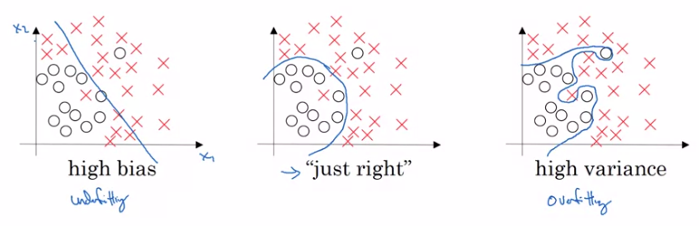
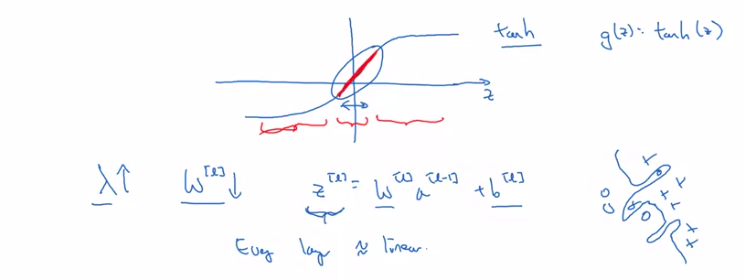
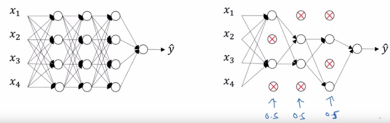
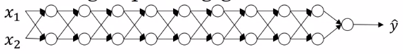
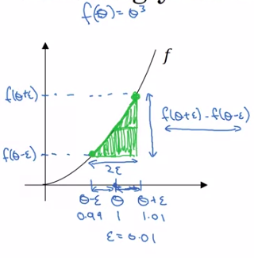

# Practical aspects of deep neural networks

[TOC]

# Setting up your deep learning application

### Train, Validation and Test set 

#### Deep learning is a highly iterative process

when training a NN you have to set a bunch of specifications (hyper-parameters) for your model to get satisfactory results such as:

1. number of layers
2. number of hidden layers
3. learning rate
4. choice of activation function
5. Regularization parameter 

so that it is impossible to correctly select them from the first experiment, so that you have configure your sittings iteratively and observe the change in your model performance, for this reason Deep learning is a highly iterative process.


#### Train/ val/ test

if you have a certain dataset from certain domain, you may want yo divide it as follow:

1. training data
2. validation data
3. test data

having this data division, then you can train your model on the **training ** data, examine which of your models perform better on the **validation** data and ultimately evaluate your final model on the **test** data in order to get unbiased estimates of how well your model is doing.

previously, it was a common practice to divide your data as 70/15/15 train-val-test splits or 60/20/20 splits if you have small amount of data 100-10000. such procedure form a best practice to train your model.

Currently in the era of big data (millions of data points), the trend is oriented toward having smaller percentages of validation and test sets. remember that the goal of validation set is to test different model setting on it and see which model works better while the main goal of your test set is to have pretty confident estimates of how well it is doing. and thus if you have 1 million examples you do not have to have  a very large validation and test sets, (1-2) % splits percentages are fair enough.


#### Mismatched train/test distribution

assume we have a model that predict whether an input image is a cat or not cat. Further, your training data is of high resolution while your test and validation data sets are of low resolution. and thus there will have a different distribution between your training data and validation test data. To overcome this issue, make sure that all data splits are coming from the same distribution


One more thing to note is :

it OK to have only **validation set ** rather than **validation and test sets**, remember that the goal of your test set is to get unbiased estimates of your model performance. if you do not need that unbiased estimate then it might be OK to omit the test set and use validation set rather. In this case you have to train on the training set and evaluate on the validation set.


### Bias / Variance

#### Bias and variance explained



​																										Figure(1) : Bias Vs Variance 

 if we have a dataset that looks like in figure (1). if you fit a straight line to the data we can see that the best fitting line is biased toward the red labels causing the model to be **Underfitted**. On the other side, if you fit an incredibly complex model, may be you can fit the data perfectly but that does not look a great fit either  as there is a high variance in the model which cause the model to be **Overfitted**. In between, having a model with medium level of complexity (bias variance traded-off)  will give a reasonable estimates. 

However this is a simple 2D problem where we are able to visualize the data and observe the model. In higher dimensional this is not achievable. So that, we will look at two other metrics which are :

1. Train set error
2. Validation set error
3. Bayes error

these two measures can be compared simultaneously to observe the model performance in term bias and variance. lets see in details how these measures works

| Train set error | Validation set error |      Model performance      |
| :-------------: | :------------------: | :-------------------------: |
|       1%        |         11%          | High variance (overfitting) |
|       15%       |         16%          |  High bias (Under fitting)  |
|       15%       |         30%          |  High bias - high variance  |
|      0.5%       |          1%          |   Low bias - low variance   |


- Case (1): In this case, the model performs very well on the training set but poorly on the validation set causing the model to overfit the training data but fails to generalized on the validation set. Ultimately you can conclude that your model has high variance.
- Case (2): in this case, the model preforms badly on the training set causing the model to be Underfitted and so the model has high bias because it was not even fitting the training set. In contrast it generalize well on the validation set as the validation set error is worse than training error by only 1% .
- Case (3): In this case. the model performs poorly on both training and validation sets. And thus it has a high bias be cause it performs poorly on the training set and high variance as it performs poorly on the test set.
- Case (4): In this case, the model performs very well and both datasets. And thus it has low bias and low variance. In fact, this kind of performance we wish to achieve.


**Note**

Pear in mind that such kind of analysis is performed with respect to the **Human Level performance** on the same dataset which called **Bayes error** which is hypothetically equal to zero (0) and vary from domain to domain. For example, if our Bayes error is 15%   then we can consider the **second** model as the optimal performance in the previously showed 4 cases.


To sum up, examining the training set error gives a sense bias problem while examining the validation set error gives a sense of variance problem.


### Basic recipe for deep learning

#### Recipe elements

the basic recipe provides the practitioner with a systematic approach to improve the model performance and reduce both variance and bias as follow:


**High Bias?**

Look at the training data performance and try single or a combination of these solutions to improve the model performance on the training data:

1. Try a bigger network (number of layers and number of units).

1. Train the model for longer time.
2. Use different architectures (RNN, CNN , etc).


**High Variance?**

Look at the validation data performance and try single or a combination of these solutions to improve the model performance on the training data:

1. Add more data.
2. Employ regularization techniques.
3. Use different architectures (RNN, CNN , etc).


A couple of points to notice:

First is that, depending on whether you have high **bias** or high **variance**, the set of solutions you should try could be quite different. So I'll usually use the training/ validation sets to try to diagnose if I have a bias or variance problem, and then use that to select the appropriate subset of solutions to try. So for example, if you actually have a high bias problem, getting more training data is actually not going to help. Or at least it's not the most efficient thing to do. So being clear on how much of a bias problem or variance problem or both can help you focus on selecting the most useful solution to try. 

Second, in the earlier era of machine learning, there used to be a lot of discussion on what is called the bias variance **tradeoff**. And the reason for that was that, for a lot of the solution you could try, you could increase bias and reduce variance, or reduce bias and increase variance. But back in the pre-deep learning era,  we didn't have as many tools that just reduce bias or that just reduce variance without hurting the other one. But in the modern deep learning, big data era, so long as you can keep training a bigger network, and so long as you can keep getting more data, which isn't always the case for either of these, but if that's the case, then getting a bigger network almost always just reduces your bias without necessarily hurting your variance, so long as you regularize appropriately. And getting more data pretty much always reduces your variance and doesn't hurt your bias much. 

So what's really happened is that, with these two steps, the ability to train, pick a network, or get more data, we now have tools to drive down bias and just drive down bias, or drive down variance and just drive down variance, without really hurting the other thing that much. And I think this has been one of the big reasons that deep learning has been so useful for supervised learning, that there's much less of this tradeoff where you have to carefully balance bias and variance, but sometimes you just have more options for reducing bias or reducing variance without necessarily increasing the other one. 


# Regularizing your neural network

### Regularization 

Simply, regularization is a set of techniques that helps your model reduce overfitting during the training by reducing the model complexity. There is a different techniques to add regularization ti your model, in this regard we are going to cover the following terms:

1.  L2 regularization.
2. L1 regularization
3. Dropout

#### Logistic regression regularization

 for sake of simplicity, we are going first to implement regularization on logistic regression before proceeding to the NN.

recall that for logistic regression you try to minimize the cost function J(w,b):


$$
J(w,b) = \frac{1}{m} *\sum_{i=1}^{m} L(\hat{y}^{(i)},y^{(i)})
$$
recall that W and b in logistic regression parameters where W is an (nx: number of features) dimensional vector and b is a real number and (i) is the number of training examples.

to add regularization to logistic regression, we extend the loss function by adding a term called L2 regularization term as follow:
$$
J(w,b) = \frac{1}{m} *\sum_{i=1}^{m} L(\hat{y}^{(i)},y^{(i)})\ +\ \frac{\lambda}{2m} ||w||^2_2
$$
where :

Labmda : is a regularization parameter that is used to control the regularization practice 

L2 : is the Euclidean norm of the weights and given by
$$
\text{L2 reglarization:}\ \ \  ||w||^2_2 =\frac{\lambda}{2m}\sum_{j=1}^{n_x} w^2_j \ =\ \frac{\lambda}{2m}(w_jw^T_j)
$$
why do we regularize just the parameter (w) and not (b)?

Indeed, you can add another term to regularize (b) in same fashion of regularizing (w), But in practice, (W) is  a pretty high dimensional parameter vector  and highly affects the learning process as well as the the cost function. On the other hand, (b) is just a single number  that whose main purpose is to add bias to your model and thus you can omit it in your implementation. Ultimately, regularizing (b) is a correct implementation that would not give a great difference if it was omitted

L2 Regularization is the most common regularization method but you might have also heard of some people talk about L1 regularization which is given by the following term:
$$
\text{L1 reglarization:}\ \ \  ||w||_1 =\frac{\lambda}{2m}\sum_{j=1}^{n_x} |w_j| \ =\ \frac{\lambda}{2m}|w_j|
$$
However, L1 Regularization is not commonly used as it forces the weights to reach (0) causing the model to be sparse which means that (W) vector wil have a lot of zeros in it. and thus L2  regularization is much more used than L1. 


#### Neural network regularization

The same practice is performed in neural networks but with a minor modifications. Let's see how it works.

the cost function of 
$$
J(w^{[1]},b^{[1]},....,w^{[l]},b^{[l]}) = \frac{1}{m} \sum_{i=1}^{m} L(\hat{y}^{(i)},y^{(i)})
$$
recall that (L) is the number of layers in your model.

to add regularization to neural network, we extend the loss function by adding L2 regularization term as follow:
$$
J(w^{[1]},b^{[1]},....,w^{[l]},b^{[l]}) = \frac{1}{m} \sum_{i=1}^{m} L(\hat{y}^{(i)},y^{(i)})\ +\ \frac{\lambda}{2m} \sum_{l=1}^{L} ||w^{[l]}||^2_2
$$
Where:
$$
\text{L2 reglarization:}\ \ \  ||w^{l}||^2_2 =\frac{\lambda}{2m}\sum_{i=1}^{n[l]}\sum_{j=1}^{n[l-1]} (w^{[l]}_{ij})^2
$$
implementing gradient descent algorithm to the model with regularization added to the loss function can be done as follow :
$$
dw^{[l]} = \frac{dJ}{dw^{[l]}} + \frac{\lambda}{m} w^{[l]}
$$
and thus the weight update then can be calculated as follow:
$$
w^{[l]} = w^{[l]} -\alpha dw^{[l]}
$$
by substituting 8 in 9:
$$
w^{[l]} = w^{[l]} -\alpha (\frac{dJ}{dw^{[l]}} + \frac{\lambda}{m} w^{[l]}) \\
>> w^{[l]} = w^{[l]} - \frac{\alpha\lambda}{m} w^{[l]} - \alpha(\frac{dJ}{dw^{[l]}})
$$
note that L2 regularization is also called **weight decay**


### Why regularization reduces overfitting?

the answer of this question lies in the regularization term **lambda**, where the value of lambda affect the weights of your model. let us see how it works:



​																													Figure(2): Why regularization reduces overfitting?

assume we are using **g(z) = Tanh(z)** activation function for the hidden layers as shown in figure (2), and thus, having a small (z) values is equal to using the linear part of **Tanh** function indicated by the red line . And hence if **Lambda** is a large number, this will cause your model weights to be smaller and consequently (z) will be relatively smaller which cause g(z) to be roughly linear and ultimately every layer is roughly linear causing your whole model to be roughly linear (less complex) and can roughly fit the noisy data points


### Dropout regularization 

#### Dropout regularization 

**Dropout regularization**  is regularization technique where a randomly selected number of neurons in each layer with a fixed probability (p)  is set to be eliminated during the training process as shown in figure (3)  resulting in a much simpler network.



​																						Figure(3): Dropout explained

#### Dropout implementation (Inverted dropout)

Inverted dropout is the most common dropout implementation method, for the sake of completeness we will discuss it using 3 layers networks and illustrate how to implement drop out in a single layer of the three layers.

```
first I am going to define a dropout vector called d3 for layer [3] whose shape is the same shape of the third layer a[3]
keep-prob = 0.8
d3 = np.random.rand(a[3].shape[0], a[3].shape[1]) < keep-prob
where keep-prob is the percentage of the neoron to be kept for the tarining in the layer [3] 
and thus d3 will be a random array with True value for array entries < keep-prop and False
values for array entries > keep-prob

consequently d3 will be multiplied elemnt wise with a3 resulting in zero value for all Falses 
a[3] = np.multiply(a3,d3)

finally we will scale out a[3] by keep-prob as follow:
a[3] =/keep-prob
to explain tha last step, assume we have 50 neuron in layer [3] and 0.8 keep-prob which means that 
on average 10 neuron will be set off during the training. And thus, loking at the value of z[4] which equal to :
z[4] = w[4]a[3] +b[4]
on expectation a[3] will be reduced by 20%. Consequently, in order to not reduce the
expected value of z[4] you need to divide a[3] by keep-prob so it is not changed the expected value of a[3] as you reduced some of the neurons.

```


To sum up, we use th (d) vector to zero out different hidden units. And in fact, if you make multiple passes through the same training set,  then on different passes through the training set,  you should randomly zero out different hidden units.  So, it's not that for one example  you should keep zeroing out the same hidden units. is that  on iteration one of gradient and descent, you might zero out some hidden units. And on the second iteration of great descent  where you go through the training set the second time,  maybe you'll zero out a different pattern of hidden units. And the vector d or d3, for the third layer,  is used to decide what to zero out,  both in for prob as well as in that prob.  We are just showing forward propagation here.


having trained the algorithm, here is what you should do at test time is **not** to use dropout at the test time and that is because we are making a prediction at test time, you do not want your output to be random. higher understanding of dropout will be achieved in the programming exercise

### 

### Understanding dropout

#### Why does dropout work?

We learned from the previous lesson that dropout reduces the number of active neurons during the training causing the network to be more simple and ultimately reduce the over fitting. this is just the first intuition. 

Another intuition. assume we have a single neurons with four input features, for this unit to do its job it needs to generate a meaningful output. now with dropout the input can be randomly eliminated each training pass. And thus, our single neuron can not rely on any single feature  because there is a chance of any features to be eliminated. So, we are reluctant to put too much weight on any one input because it may be eliminated. Ultimately, the neuron will be motivated to spread out the weights to each of the fore units which in turn will have similar behavior of L2 Regularization and prevent overfitting.

one more piece of detail when you are implementing dropout is that you can specify different **keep-prob** for different layers . The best practice here is to reduce the **keep-prob** where you have layers with high number of parameters and increase it for the small layers or making its **keep-prob ** equal to one.

you can also apply the dropout to the input features but it is not a good practice to do, but in case you want to do that, try to keep it as high as possible for example 0.9.

One big downside of drop out is that the cost function J is no longer well-defined.  On every iteration, you are randomly killing off a bunch of nodes.  And so, if you are double checking the performance of gradient descent,  it's actually harder to double check that you have  a well defined cost function J that is going downhill on every iteration.  Because the cost function J that you're optimizing is actually  Less well defined, or is certainly hard to calculate.  So you lose this debugging tool to plot a cost a graph.  So what I usually do is turn off drop out, and I run my code and make sure that it is monotonically decreasing J, and then turn on drop out and hope that I didn't introduce bugs into my code during drop out.


### Other regularization methods

#### Data augmentation

In some cases it is too expensive to get more data for your model and you can not get more data. as a solution you can augment your data by generating new examples from the available data and this what is meant by data augmentation. For example, assume you have a classification problem where you want to classify images as cat (1) not cat (0) and you have set of images for this problem, you can augment your data by :

-  flipping images vertically or horizontally.
- rotating images with a certain degree.
- take crops of the image 
- adding distortions

in this way, you can increase your data and reduce over fitting in the model.


#### Early stopping

In early stopping, you track your model loss on both training and validation sets. In the beginning of the training both loss are going to decrease monotonically and after certain  number of iterations your training loss will keep going downside while the validation loss will increase or remain the same indicating that your model is overfitting  and can not generalize more on the unseen data but instead on the training data. At this point you can stop training earlier.


# Setting up your optimization problem

### Normalizing inputs

#### Normalizing training sets

When training a neural network, one of the techniques that will speed up your training is to normalize your inputs in a way that bring all the input data into the a unified values rather than having input feature with big value  (hundreds or thousands) and other input features with smaller values (fractions) and thus having a large variance in your dataset. such step will inevitably helps reducing the way to optimize the cost function as all inputs are of a unified scale and thus it will have a smoother shape 

to normalize your data, you have to calculate the **mean** and **standard deviation ** of your input data and then subtract the mean from each data point and divide the subtraction bu the standard deviation according to the equation (11)
$$
x_{norm} = \frac{x-\mu}{\sigma}
$$
where:
$$
\mu = \frac{1}{m} \sum_{i=1}^{m} x^{(i)}
$$
And:
$$
\sigma = \sqrt{\frac{\sum_{i=1}^{m}(x_i-\mu)^2}{m}}
$$
One more thing to note is that when normalizing your data, do not normalize your data separately, meaning that the training and validation sets must be brought to the same scale


### Vanishing/ exploding gradients

#### Vanishing/ exploding gradients explained

One of the problems of training neural network, especially very deep neural networks, is data vanishing and exploding gradients. What that means is that when you're training a very deep network your derivatives or your slopes can sometimes get either very, very big or very, very small, maybe even exponentially small, and this makes training difficult.  lets explain this more clearly



​															Figure(4): Vanishing/ exploding gradients explained

assume we have a deep NN as with two input features and 10 layers each with 2 neurons as shown in figure(4)

```
each layer will have wieghts matrix w[1], w[2], w[3].....w[10]

for the sake of simplicity lets assume we are using linear activation function and ignoring b  for now.
g(z) = z

accordingly :
yhat = w[10]w[9]w[8]w[7]w[6]w[5]w[4]w[3]w[2]w[1]x
where:
z[1] = w[1]*x and a[1] = g(z[1]) = z[1]
z[2] = w[2]z[1] and g(z[2]) = z[2] = w[2]w[1]x
.
.
.
.
.
.
z[10] = w[10]z[9] .... and so on

For exploding gradients assume that each layer has the following identity matrix for the weights 
where the diagonal has values larger than 1as follow:

w[1]= [1.5 0
	   0 1.5]
	   
yhat = w[10] *[1.5 0 ^(10-1)   * x
	   		   0 1.5]

yhat = w[10] =1.5^9 * x
yhat =38.45 * w[10] * x 
and thus the value of yhat will grow exponentially causing it to explode


For vanishing gradients assume that each layer has the following identity matrix for the weights 
where the diagonal has values less than 1 as follow:

w[1]= [0.5 0
	   0 0.5]
	   
yhat = w[10] *[0.5 0 ^(10-1)   * x
	   		   0 0.5]

yhat = w[10] =0.5^9 * x
yhat =0.00195 * w[10] * x 
and thus the value of yhat will decrease exponentially causing it to vanish
```


the main point to get here is that if the weights are a little bit larger than 1 or less than 1, this will cause your mode either to explode or vanish according to the number of layers in your model. This problem can be improved with the proper  weights initialization. this explanation is made from forward propagation point of view and the same argument is held when implementing back propagation 


### Weight initialization for deep NN

In the last lesson you saw how very deep neural networks can have the problems of vanishing and exploding gradients. It turns out that a partial solution to this, doesn't solve it entirely but helps a lot, is better or more careful choice of the random initialization for your neural network. . To understand this, let's start with the example of initializing the ways for a single neuron, and then we're go on to generalize this to a deep network. Let's go through this with an example with just a single neuron, and then we'll talk about the deep net later.

#### Initialization mechanisms 

assume we have a NN with single neuron and four input features, lets illustrate how to initialize it.

```
assume we have a NN with single neuron and four input features, lets illustrate how to
initialize it.,for this network:
z = w1x1 + w2x2 +w3x3 +w4x4
further, assume that b is ignored for the sake of simplicity
so in order to ensure that z is not going to explode or vanish you notice that the larger 
the number of features, the smaller the weights value you want to be. this is z = wixi and 
as youa dding lots of input features you want the weights value to be smaller
one possible solution is to set the variance of wi to :
var(wi) = 1/n
where n is the number of features input to the neuron

for deep neural network we initialaize the weights matrices as follow:
W[l] = np.random.randn(shape)* np.sqrt(1/n[l-1])
where n[l-1] is the number of neurons in the previous layer with respect to the current layer

for Relu activation function:
var(wl) = 2/n[l-1]
where n is the number of features input to the neuron
W[l] = np.random.randn(shape)* np.sqrt(2/n[l-1])

for Tanh
var(wl) = 1/n[l-1] 
W[l] = np.random.randn(shape)* np.sqrt(1/n[l-1])
```


### Numerical approximation of gradients

#### Checking your derivative computations

When you implement back propagation you'll find that there's a test called gradient checking that can really help you make sure that your implementation of back prop is correct. Because sometimes you write all these equations and you're just not 100% sure if you've got all the details right in implementing back propagation. So in order to build up to gradient and checking, let's first talk about how to numerically approximate computations of gradients 


Assume that we have a cubic function **f(theta) = theta^3** as shown in figure (5) and we want to compute the derivative at the point **(theta = 1)**. As we learned in the first part of the course when computing the function derivatives, we were nudging the **theta** value by a very small number in an increasing manner. For now, we will nudge **theta** increasingly and decreasingly by of **Ebselon =0.01** to get **(x - Ebselon =0.99)** and **(x + Ebselon = 1.01)**



​																			Figure(5): Gradient checking explained

As a result, we can get better estimate of the gradients by computing the derivative on both sides of **theta** rather one side (i.e. taking the largest triangle whose width is **2Ebselon** and length is **f(theta +Ebselon) -f(tehta - Ebselon)**). So lets look at the math:

```
to compute the derivative ge(theta), we divide the length of the triangle by its width as follow:

g(theta) =  (f(theta +Ebselon) - f(tehta - Ebselon))/2Ebselon

==((1.01)^3 - (.99)^3)/(2*0.01) = 3.0001 

now be derivation rules we know that theta^3 derivative is 3theta^2
g(1) = 3 * 1^2 = 3
which is very close to the value we have got by approximation with approximation error of 
0.0001

on the other hand if we took one sided nudge, we well have g(1) =3.0301 with aproximayion error of 0.0301
```

As a result, implementing gradient descent with two sided difference way of approximating the derivative you find that your implementation is correct. One more thing to note is that using this method will slow your model in a doubled manner if the one-sided gradient checking were employed 


### Gradient checking for a neural network

#### Gradient check for a neural network

Gradient checking is a technique that's helped me save tons of time, and helped me find bugs in my implementations of back propagation many times. Let's see how you could use it too to debug, or to verify that your implementation and back process correct. 

```
the first step to check your gradients is:
take all your network parameters W[1],b[1] ....W[L],b[L] and reshape them into a big vector 
theta by conacatination. thes will result in a cost function j(theta) rather than j(W[1],b[1] ....W[L],b[L])

the second step is :
take all your network parameters dW[1],db[1] ....dW[L],db[L] and reshape them into a big vector d(theta) by conacatination

remeber that both W and dW have the same dimensional shape.

j(theta) can be written as j(theta_1, theta_2, theta_3,.....theta_i)

the question now is  d(theta) is the slope of the cost ftunction j(theta), let's imlement it 
in details:

for each theta_i in theta:
	dtheta_i_approx = j(theta_1, theta_2,.....theta_i + Ebselon) - j(theta_1, theta_2,.....theta_i - Ebselon)/2* Ebselon 

from the previous lesson we saw that this term approximately equal to d(theta_i) or dj/d(theta_i)

and thus you end up with two vectors dtheta_approx and dtheta and both are of the same dimension. Our goal now is to check if these two vectors are approximately the same, let's see how it works:

this step can be completed by the euclidean distance between the two vectors as follow:

check = np.sqrt((d(theta_approx) - d(theta)^2)/(np.sqrt(d(theta_approx)^2 + np.sqrt(d(theta)^2) 

in practice, when implement gradient checking we usually take ebselon as 10^-7 and 
having such value from checking is great practice which means that your derivative 
approximation is very likely to be correct

10-5 : take a careful look on the d(theta_approx) and d(theta) compnents
10-3 : start to wory about your gradient descent implemnetations
```


### Gradients checking implementation notes

#### Implementation notes

1. Do not use **gradient checking** in training, but only to debug: this is because computing  d(theta_approx_i) is a very slow computation so that compute it for some iterations and stop it for others.
2. If your model fails grad check, look at components and try to identify the bug: this means if d(theta_approx_i) is very larger than d(theta) at certain location gives indication at the location of the component where the gradient have a problem
3. Remember regularization term if you are using regularization: this means that you have to remember to add the regularization term to the gradients checking when implementing it.
4. Gradient check does not work with dropout: because dropout eliminate certain percentage of neuron in each iteration. an alternative solution is to implement grad check without dropout and then turn on the grad check.
5. Run at random initialization, perhaps again after some training.